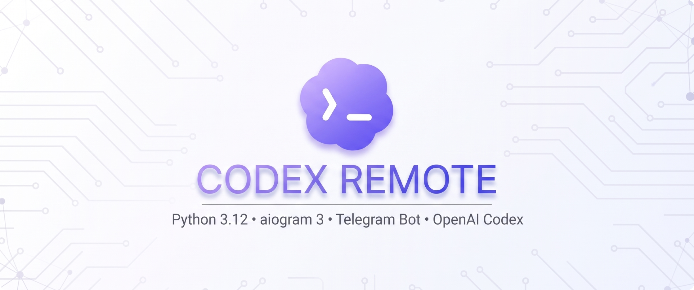

# Codex Remote Project

<a href="LICENSE"></a>


<p align="center">
  
</p>

<p align="center">
  <b>Codex Remote</b> - this is a Telegram bot that allows you to remotely control the <b>Codex CLI</b> on your PC, assign tasks to it, monitor its progress, and partially manage the system.
</p>

---

<p align="center">
  <b><a href="docs/README-ru.md">Russian version</a> | English version</b>
</p>

<p align="center">
  <em>You can easily switch between localized documents depending on your preference. The Russian documentation contains the full setup guide, configuration details, and usage examples.</em>
</p>

---

## Project navigation

- [Information about the project](#information-about-the-project)
- [Quick Start & Installation](#quick-start--installation)
- [Update Roadmap](#update-roadmap)
- [Project documentation](docs/documentation/docs-en.md)
- [License & Copyright](#license--copyright)

---

## Information about the Project

Codex Remote is a Telegram bot that provides a remote interface to Codex CLI running on your personal computer. It can serve as an alternative to the official remote-control workflow for Codex, which requires an OpenAI subscription and the official ChatGPT application. The ChatGPT application is not available for every operating system, including Arch Linux. This project is designed for situations where you want to start coding or system tasks from your phone, send prompts to Codex, and receive the results without having direct access to the computer's terminal. It acts as an integration layer around an already installed Codex CLI and does not include or replace Codex CLI itself.

When you use `/codex`, the bot launches Codex CLI in headless mode inside a pseudo-terminal and forwards the task output back to Telegram. It shows the current progress, returns the final answer, reports execution time and token usage, and can continue the same Codex conversation with a follow-up task. Interactive process prompts can be answered from Telegram with buttons or ordinary messages.

In addition to Codex, the bot provides a controlled remote shell workflow. You can change and inspect the working directory, list files, run Git commands, execute shell commands, and pass regular text input to a running process. Each Telegram administrator has an isolated session with its own working directory, process state, and Codex conversation.

The project also includes an administrator whitelist, activity logs, model selection through the Codex configuration file, and user-level systemd service controls for checking or restarting the bot. It is intended for personal or trusted environments where remote access to the host machine is needed through a private Telegram interface.

---

## Quick Start & Installation

### Requirements

The supported environment is Linux with Python 3.12 or newer. Codex CLI must be installed and authenticated separately, and the `codex` command must be available in the environment where the bot runs. Git is also required for cloning the repository.

The project is built around Unix pseudo-terminals, `/bin/bash`, and user-level systemd. Native Windows execution is not currently supported. Windows users should use WSL2 with a Linux distribution such as Ubuntu and follow the Linux instructions inside WSL2. Codex CLI must be installed and available inside that WSL2 environment as well.

### Clone the repository and install dependencies

```bash
git clone https://github.com/Kyreesemm/codex-remote.git
cd codex-remote
python3 -m venv venv
source venv/bin/activate
python -m pip install --upgrade pip
python -m pip install -r requirements.txt
```

On Windows with WSL2, run the same commands in the WSL2 terminal. A Windows directory can be accessed from WSL2 through a path such as `/mnt/c/Users/YourName/projects`.

### Create a Telegram bot

1. Open Telegram and start a conversation with [@BotFather](https://t.me/BotFather).
2. Send `/newbot` and follow the instructions to choose a bot name and username.
3. Copy the token issued by BotFather. It is required for the `BOT_TOKEN` setting and should be kept private.
4. Find your Telegram numeric user ID, for example with [@userinfobot](https://t.me/userinfobot). Only IDs listed in `ALLOWED_ADMIN_IDS` can use the bot.

### Configure the environment

Create the configuration file from the example:

```bash
cp .env.example .env
```

Open `.env` and set at least these values:

```dotenv
BOT_TOKEN=your_token_from_botfather
ALLOWED_ADMIN_IDS=123456789
INITIAL_CWD=/home/youruser/projects
CODEX_COMMAND=codex
SHELL_COMMAND=/bin/bash
```

`ALLOWED_ADMIN_IDS` may contain several comma-separated Telegram user IDs. `INITIAL_CWD` is the starting directory for sessions. Set `CODEX_COMMAND` to the full path if Codex CLI is not in `PATH`. On WSL2, use Linux paths such as `/mnt/c/Users/YourName/projects`, not `C:\Users\YourName\projects`.

Do not commit `.env` or share its contents. It contains the Telegram bot token. The remaining options in `.env.example` control output update intervals, Telegram message length, logging, Codex configuration, and other runtime behavior.

### Simple launch with Python

For a manual launch on Linux or WSL2, activate the virtual environment and run the entry point:

```bash
source venv/bin/activate
python bot_worker.py
```

The process remains attached to the current terminal. Stop it with `Ctrl+C`. This mode is useful for the first launch, testing, and troubleshooting. The bot loads `.env` from the project directory automatically.

On native Windows, `python bot_worker.py` is not considered a supported launch method because the project depends on Unix PTY behavior and a Unix shell. Use WSL2 instead.

### Run as a Linux systemd service

The repository includes `systemd/codex-remote.service`. The included file contains example absolute paths, so edit `WorkingDirectory`, `ExecStart`, and `EnvironmentFile` to match the actual location of your clone before installing it.

```bash
mkdir -p ~/.config/systemd/user
cp systemd/codex-remote.service ~/.config/systemd/user/codex-remote.service
systemctl --user daemon-reload
systemctl --user enable --now codex-remote.service
```

Check the service and view its logs with:

```bash
systemctl --user status codex-remote.service
journalctl --user -u codex-remote.service -f
```

The service is configured to restart after a failure. If it must continue running after logout, enable user lingering with `loginctl enable-linger "$USER"` when permitted by the system administrator. The bot's `/service` command can then report the service status or request a restart.

User-level systemd is a Linux feature. There is no equivalent Windows service configuration in this repository. On Windows, run the project inside WSL2 and configure the Linux systemd service there only if systemd is enabled in that WSL2 distribution.

---

## Update Roadmap

The following improvements are planned:

- **Platform support**
  - Adapt the project for native Windows operation.
  - Improve compatibility with a wider range of Linux distributions.
- **Bot interface and commands**
  - Add English language support to the bot.
  - Add new bot commands and capabilities.
- **Documentation for code agents**
  - Document how code agents can update the bot while it is running.
- **Modular architecture**
  - Add a module system that allows new functionality to be added without changing the bot's core code.

---

## License & Copyright

This project is licensed under the [MIT License](LICENSE).

Codex Remote was developed by one person. **Codex CLI was developed by OpenAI and is not my project.** The Codex icon used in the project banner is the Codex icon and is not my original work.

Development by Kyreesemm (KRM Tech Software)
